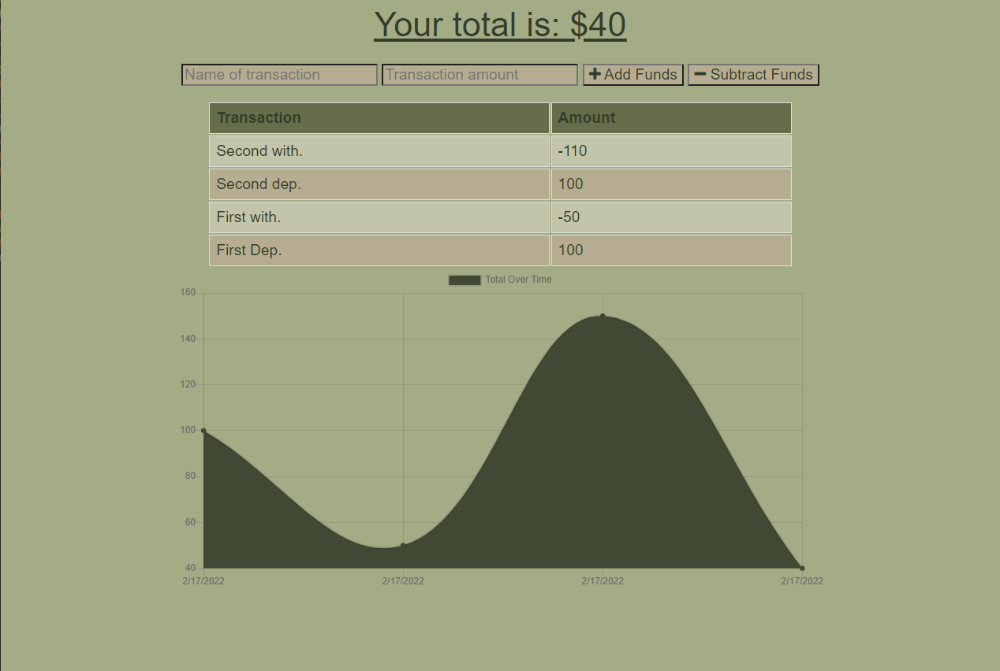

# budget_anywhere
---

  
  
   
   
   
   
   
   
## Description

This is both a website and a PWA (Progressive Web App) which allows the user to track their budget.  This app integrates the ability to do transactions when you are connected with the internet, but also when you are offline.  It utilizes a service worker and IndexedDb to allow for this offline functionality.  In addition, you can install this app on your mobile device or desktop by clicking the symbol in the address bar.

---
  ## Table of Contents

  [Features](#features)

  [Screenshot](#screenshot)

  [Installation](#installation)
    
  [Usage](#usage)
    
  [License](#license)
    
  [Contributing](#contributing)

  [Questions](#questions)
  
  

---

## Features

      1. Online and offline functionality 

      2.  Progressive Web Application

      3.  Uses Canvas to generate a visually appealing graph.

      4. Progressive Web Application 

      5.  MongoDB 

      6.  Mongoose 

      7. Service Worker 

      8. IndexedDB
---

## Screenshot 
  
  
  

  ---

  ## Installation

      1. Either Clone from my github, or go to heroku. 

[To try the application on Heroku click here!](https://tgtiburon-budget-anywhere.herokuapp.com/)
---
  ## Usage

      1. Either go to heroku, or clone and at the command prompt type npm start 

  ---
  ## License 

  &emsp; 

      To read about the license of this project click the link below.

  &emsp;[License](https://github.com/tgtiburon/budget_anywhere/blob/main/LICENSE) 

  ---
  ## Contributing

      1. Email me or post an issue in the issue tracker. 

---
## Questions

If you have any questions about this project feel free to email me at <tg.tiburon@gmail.com>.  

To see the rest of my portfolio, visit [Github](https://github.com/tgtiburon).

Below is a graphic displaying my most used languages on github.

This Readme file was created with Readme Architect by Tony Gendreau &copy;
