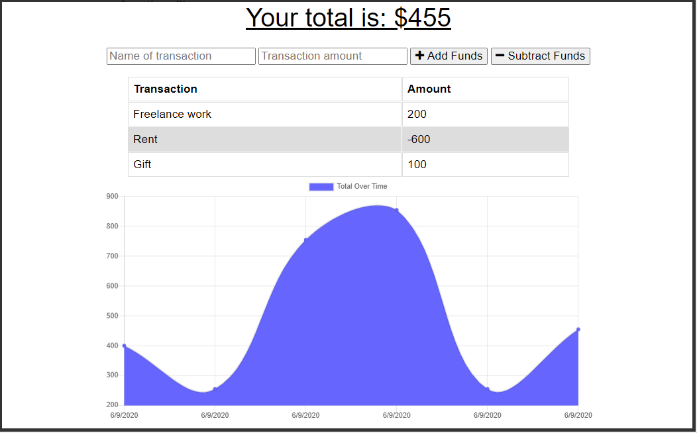

# Budget_Anywhere

Video of app in action:

GET routes to return all: 1. categories 2. products, 3. tags

## User Story
AS AN avid traveler
I WANT to be able to track my withdrawals and deposits with or without a data/internet connection
SO THAT my account balance is accurate when I am traveling 

## Acceptance Criteria

- []    GIVEN a budget tracker without an internet connection
        WHEN the user inputs an expense or deposit
        THEN they will receive a notification that they have added an expense or deposit

- []    WHEN the user reestablishes an internet connection
        THEN the deposits or expenses added while they were offline are added to their transaction history and their totals are updated

## Getting Started:

- []    Use IndexedDB to add offline functionality
        (review 18.4 lesson)

- []    Add a service worker
        (review 19.4 lesson)

- []    idb.js added to `public/js/`   
            
- []    Add service worker to the route of the `public/` directory

## Once you updated the app it should:

- []    Deposit while offline

- []    Enter expenses offline

- []    offline entries added once the app is brought online

## Web Manifest

- []    mobile first app so include a (manually made) manifest.json which includes:

- []    name  

- []    short_name

- []    icons

- []    theme_color

- []    background_color

- []    start_url

- []    display

- []    Add manifest.json to the root directory of the `public/` directory
        (review 19.5 Lesson)

## Deploy to Heroku

- []    MongoDB Atlas (review 18.5 Lesson)

- []    Add Mongoose Validation

## Grading Requirements

- [] This Challenge is graded based on the following criteria:

## Technical Acceptance Criteria: 40%
- []    Includes Service Worker

- []    Includes Web Manifest

- []    IndexedDB for offline functionality

- []   Deployed to Heroku

## Deployment: 32%

- []    Application deployed at live URL

- []    Application loads with no errors

- []    Application Github URL Submitted

- []    Github Repository contains application code

## Application Quality: 15%
- []    User experience is intuitive and easy to navigate.

## Repository Quality: 13%
- []    Repository has a unique name.

- []    Repository follows best practices for file structure and naming conventions.

- []    Repository follows best practices for class/id naming conventions, indentation, quality comments, etc.

- []    Repository contains multiple descriptive commit messages.

- []    Repository contains quality README file with description, screenshot, and link to deployed application.

## How to Submit the Challenge
- []    You are required to submit BOTH of the following for review:

- []    The URL of the functional deployed application

- []    The URL of the GitHub repository. Give the repository a unique name and include a README describing the project.